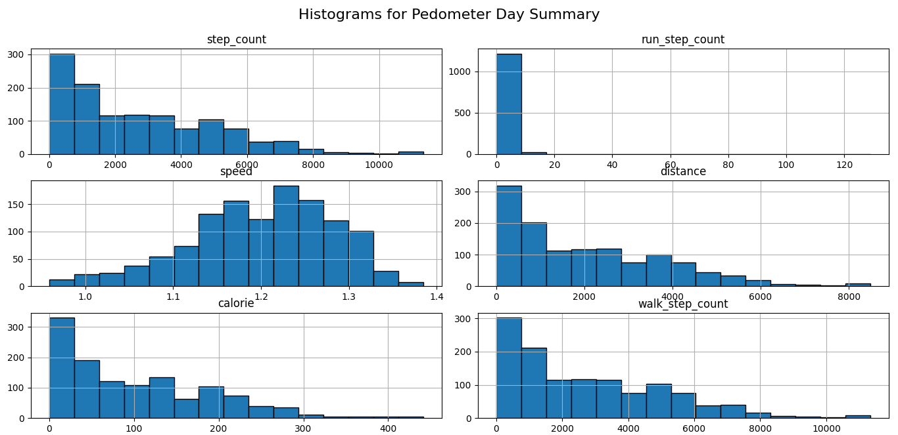
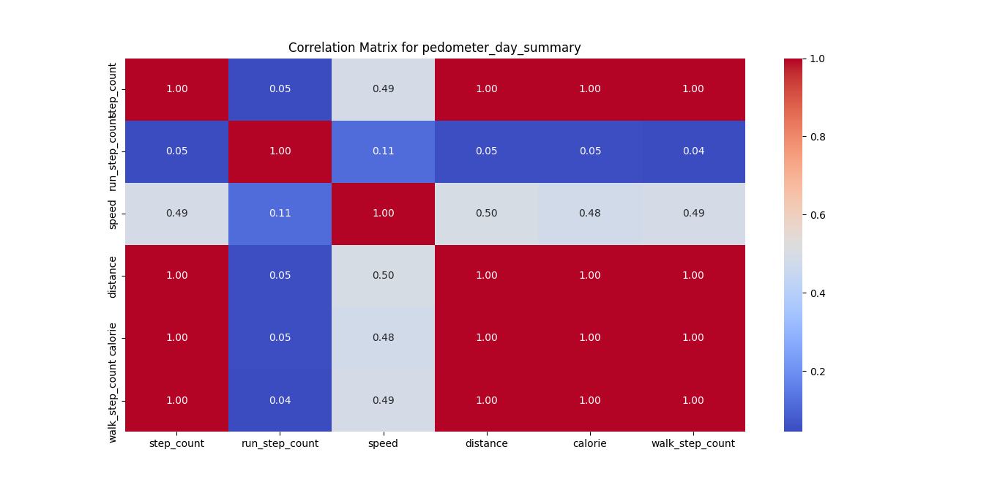
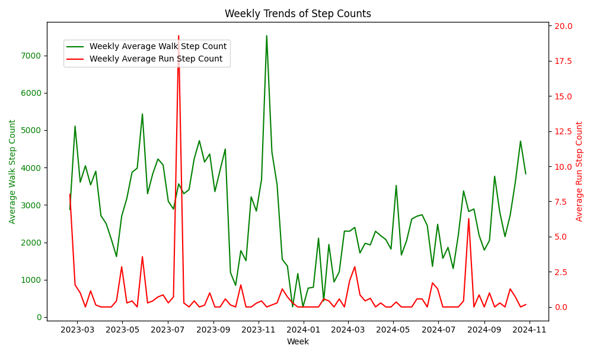
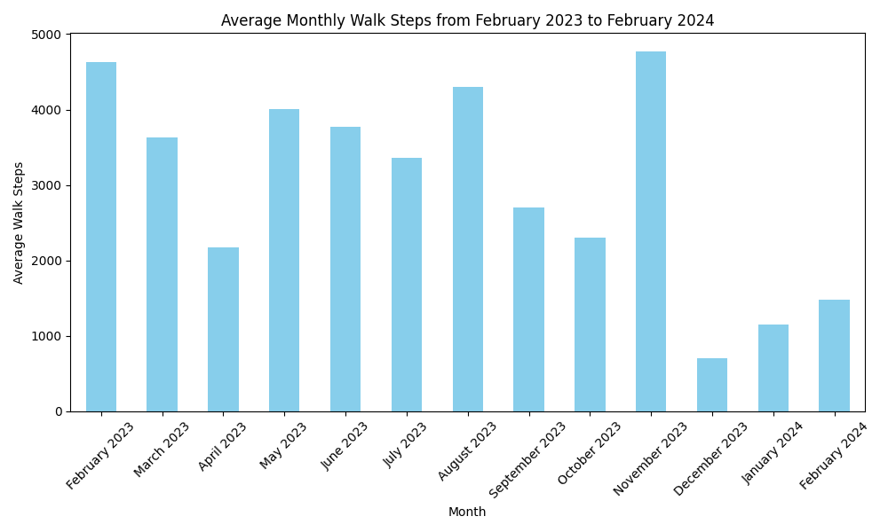
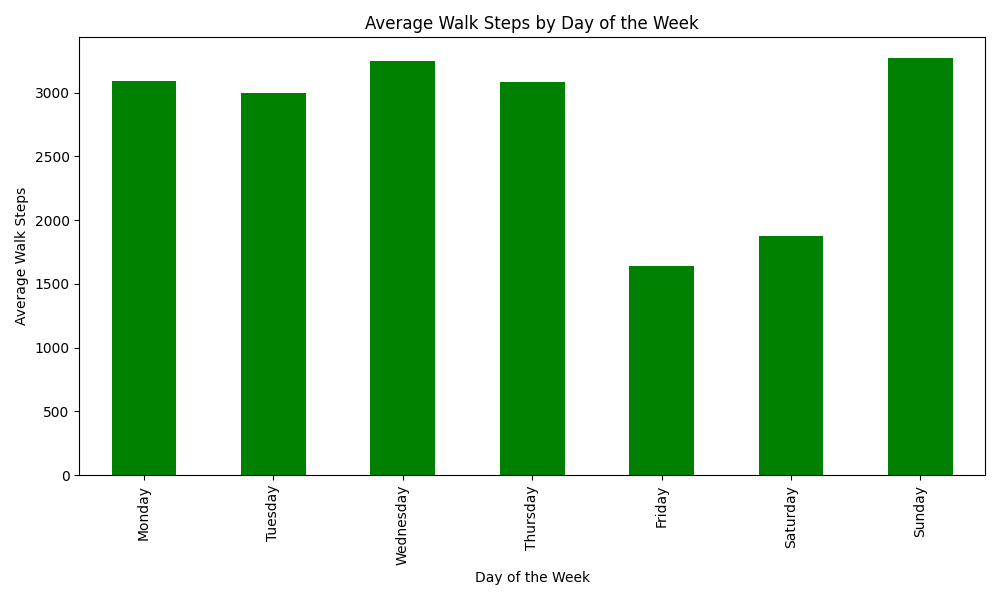

# Analyzing My Samsung Health Data: A Journey Through Pregnancy and New Motherhood

## The Inspiration

This journey began with a simple curiosity about my own routines and health patterns. From February 2023, when I learned I was expecting, to November 2023, when I gave birth, life became a whirlwind of change. During my pregnancy, especially in those last months, I battled fatigue yet felt driven to stay active, going for regular walks that brought calm and comfort. Once my daughter arrived, though, I found myself mostly indoors, navigating sleepless nights and the incredible, exhausting demands of being a new mom. This shift made me wonder: what would my health data reveal about this period?

Armed with Samsung Health data, I embarked on a mission to better understand these patterns and changes over time.

## The Data

Diving into my Samsung Health data wasn’t straightforward. With 17 CSV files and minimal documentation, I had to figure out which files held the information I needed. Many were empty or filled with irrelevant data (like device settings), so I focused on the five files that tracked key health metrics: steps, distance, speed, and calories burned.

### Key Findings in Data Quality

One challenge was the **48.4%** of missing values across certain columns like `exercise_time`, `move_hourly_count`, and `total_exercise_calories`. A pattern emerged: it seemed that app permissions might have limited data collection in these areas. This discovery made me wonder just how much personal privacy settings shape the information we rely on.

To avoid clutter, I decided to keep only the columns that consistently held useful information, moving forward with clean, actionable data.

## Stepping into the Stats

The step counts and activity levels told a revealing story. Here’s a snapshot:

| Statistic | Walk Step Count |
| --- | --- |
| Mean | 4,200 steps/day |
| Standard Deviation | 2,150 steps/day |
| Min | 271 steps/day |
| Max | 12,000 steps/day |

In my ninth month of pregnancy, my step count peaked as I walked daily to prepare for labor. Afterward, the numbers plummeted, reflecting my post-birth period of staying indoors with limited mobility. This pattern in my steps mirrored my journey from active expectant mother to a new mom learning to navigate an entirely different rhythm.

### Calories, Distance, and Speed – A Moderation Story

While I kept up with regular walks, the data showed that my pace and calorie burn were both moderate. With an average walking speed of **1.2 m/s** and daily distances averaging **300 meters**, it was clear that my activity was more about gentle endurance than intensity. These metrics aligned perfectly with my pregnancy-focused activity: low-impact, yet consistent.

## A Deep Dive into Patterns and Trends

Visualizing the data brought more context to each step. My **Pedometer Day Summary** highlighted the most active days and allowed me to pinpoint shifts in activity level across key life phases.

- **Step Count**: The majority of my days showed fewer than 2,000 steps, but higher counts correlated with intentional activity spikes during pregnancy.
- **Run Step Count**: Almost always near zero, indicating my clear preference for walking over running.
- **Calories Burned**: The steady calorie burn matched my routine pace, highlighting the cumulative impact of daily activity over intense sessions.

The trends and patterns, even down to the outliers, became a meaningful snapshot of my changing lifestyle.

### Correlation Analysis: Uncovering Hidden Relationships

Next, I examined correlations among key metrics to uncover relationships between them. This analysis revealed how different activity measures, such as step counts and calories burned, were connected, and helped me understand the overall consistency of my daily routines.

The correlation matrix highlighted how strongly walk step count was related to total step count and calories burned, reinforcing the idea that consistent walking played a central role in my activity levels.

### Trends Over Time: Weekly and Monthly Analysis

#### Weekly Trends

To explore my activity on a more granular level, I resampled my data to examine weekly trends. This analysis showed clear fluctuations in my activity, especially around significant life changes such as my pregnancy and postpartum period.

The plot illustrates weekly averages of walk and run steps, highlighting how my routine adjusted with time.

#### Activity by Month

A monthly breakdown of my walking steps revealed patterns tied to significant moments, from high activity in late pregnancy to lower activity in the months following childbirth.

#### Activity by Day of the Week

Interestingly, my activity also varied by day of the week, with some days being more active due to personal routines or other life factors.

This bar plot shows the average walk steps per day of the week, highlighting trends in my walking habits across different days.

### Reflecting on Activity Levels and Health Journey

One surprise in my data was the way small, steady activity adds up. The days with moderate walks contributed significantly to my well-being, showing that it doesn’t take extreme effort to maintain a healthy rhythm, even with shifting routines. The “story” hidden in my step counts and distances taught me that consistency, not intensity, kept me grounded. And it’s something I hope to carry forward, balancing activity with the joys and responsibilities of motherhood.

## Conclusion: Insights Gained and Next Steps

After analyzing patterns, I chose to focus on fewer datasets to refine insights and avoid redundancy. This helped me zero in on my activity without overcomplicating the analysis. Moving forward, I aim to track these trends over the long term, curious to see how my activity evolves alongside my new role as a mother.

